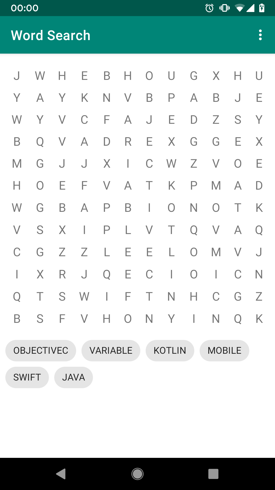
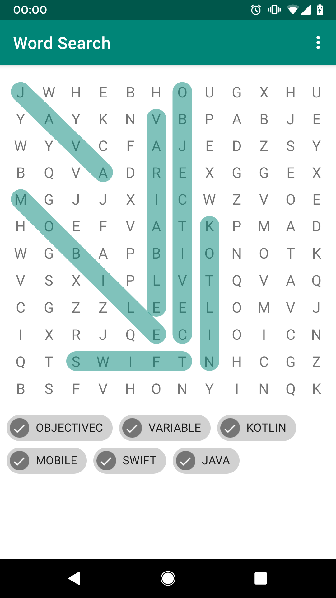

# Word Search

This is a simple word search game. A randomized 12x12 grid with 6 words (ObjectiveC, Variable, Kotlin, Mobile, Swift, Java) 
is created. The words can be vertical, horizontal, diagonal, and the reverse of any of the three. (Reversed words can be disabled in the dropdown menu).

## Instructions

To mark the words as found, simply swipe from the start to the end of the word. The word will be highlighted and checked off from the list.

## Build Instructions

Clone into Android Studio and build/run.

## Screenshots

